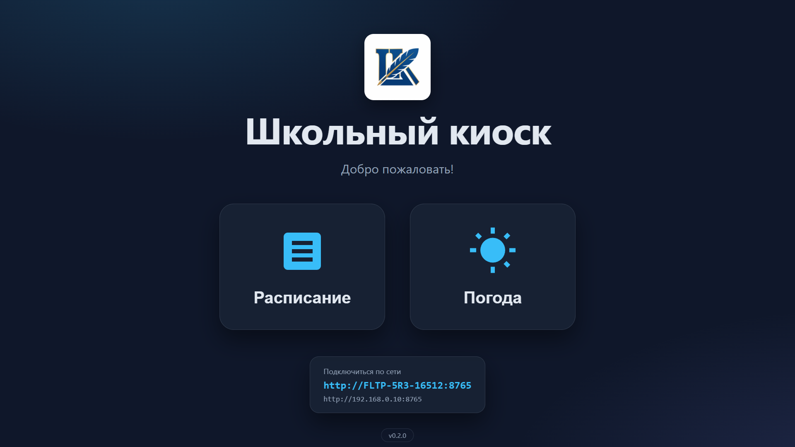
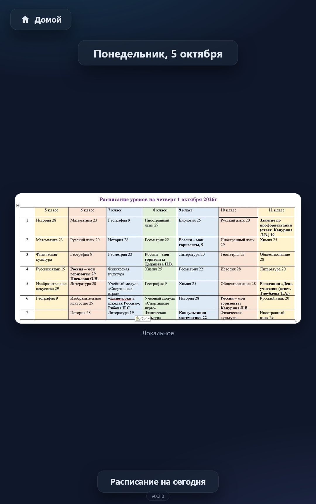
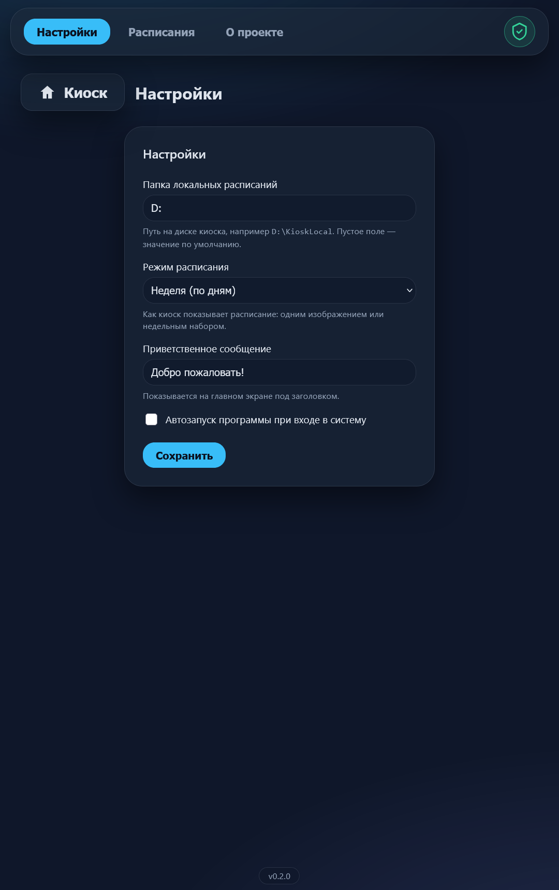
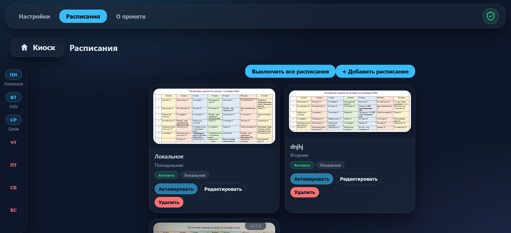

# Школьный киоск

 
**Бесплатный информационный киоск для школ и учебных заведений.**

Приложение показывает расписание, объявления и другую информацию о школе
на сенсорном экране. Работает автономно — не требует
сервера и установки Python/Rust/Node на компьютер школы.

---

## Возможности
- **Расписание** - на день и на неделю (реализовано).
- **Объявления** - бегущая строка и лента новостей (в планах).
- **Прогноз погоды** - погода в вашем населенном пункте (в планах).
- **Режим простоя** - слайд-шоу когда никто не взаимодействует.
- **Автообновления** - приложение обновляется само (реализовано).
- **Автономность** - работает локально на киоске.
- **Удаленное администрирование** - подключение к киоску по локальной сети для управления.

---

## Скриншоты

---

## Как установить
**Для школы (Windows):**
1. Скачайте установщик `School.Kiosk_X.Y.Z-main.N_x64-setup.exe` из [последнего main релиза](https://github.com/wiltort/school-kiosk/releases). Релизы с тегом `dev` предназначены для тестов.
2. Запустите его и следуйте инструкциям.
3. После установки запустите приложение - киоск готов.
4. Доступ к админским настройкам - по ссылке на главном экране киоска через локальную сеть. По умолчанию логин - `admin`, пароль - `admin`.

Руководство пользователя - [docs/user-manual/MAIN.md](docs/user-manual/MAIN.md)

---

## Обратная связь
Если вы хотите оставить отзыв или сообщить о проблеме, напишите на:
**school-kiosk@yandex.ru**

Мы не собираем статистику автоматически. Если вы напишете нам,
мы будем использовать ваш email только для ответа вам.

## Разработка
Проект — монорепозиторий: Python-бэкенд (FastAPI + SQLAlchemy),
фронтенд (React + TypeScript + Vite) и десктоп-оболочка (Tauri + Rust).

- [docs/DEVELOPMENT.md](docs/DEVELOPMENT.md) — как запустить локально.
- [CONTRIBUTING.md](CONTRIBUTING.md) — как помочь проекту.
- [CHANGELOG.md](CHANGELOG.md) — что меняется между версиями.
- [ROADMAP.md](ROADMAP.md) — куда движется проект.

---

## Лицензия

MIT. Подробности — в [LICENSE](LICENSE).

---

## ⚠️ Важно

Этот проект предоставляется **бесплатно и "как есть"**.
Разработчик не несёт ответственности за любые последствия
использования программы. Подробности — в
[docs/legal/TERMS.md](docs/legal/TERMS.md).
