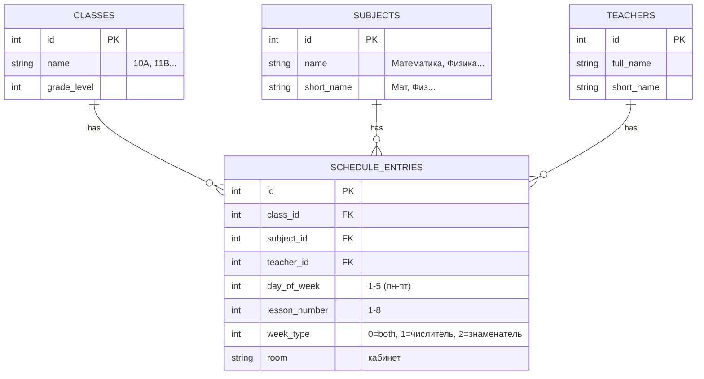
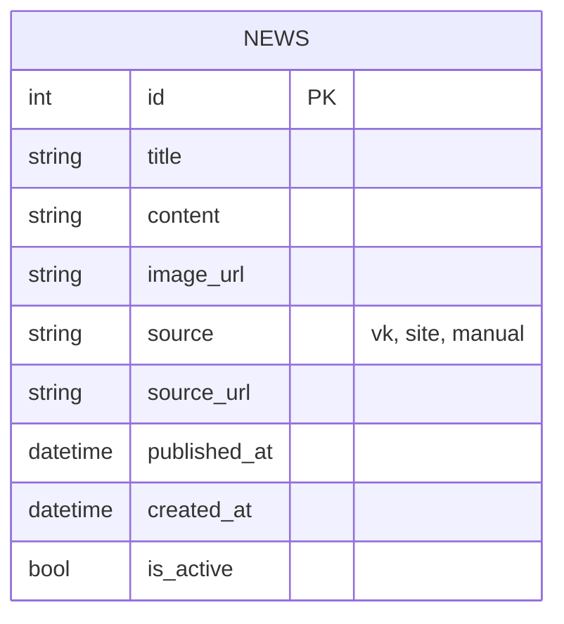
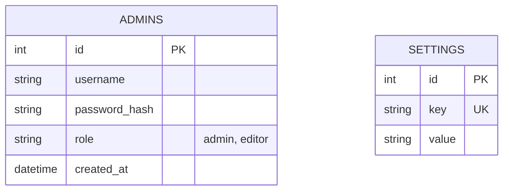
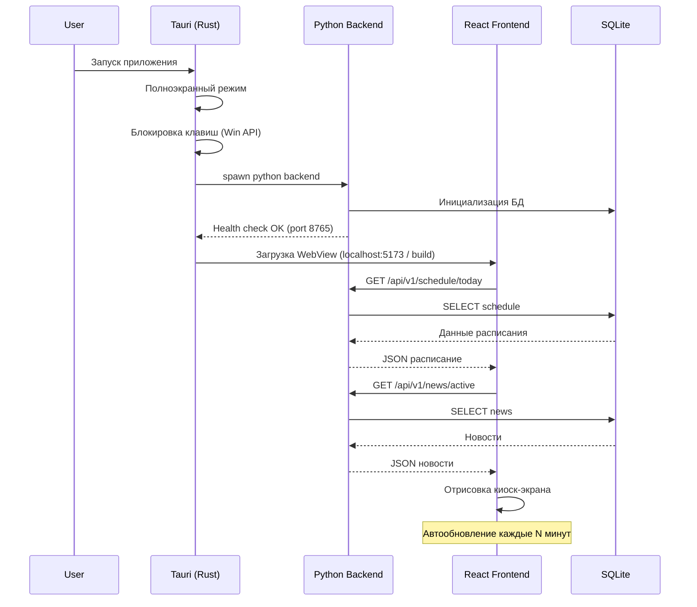
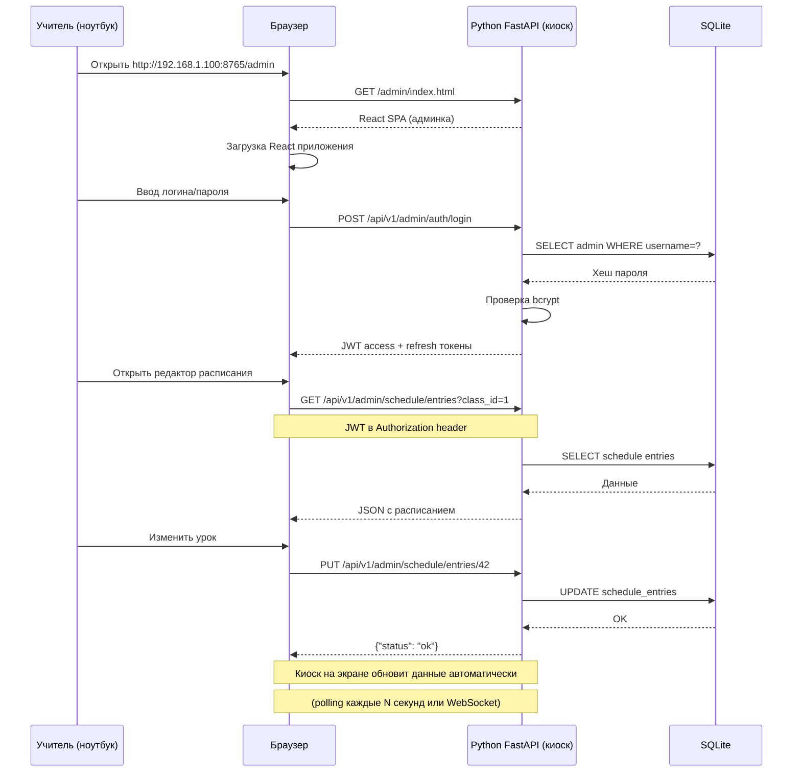

# School Kiosk — Архитектура проекта (Python + Tauri + React)

## 1. Общая архитектура

```
+------------------------------------------------------------------+
|                     Локальная сеть школы                          |
|                                                                   |
|  +----------------------------+    +----------------------------+ |
|  |   ПК с киоском (Windows)   |    |  Ноутбук учителя           | |
|  |                            |    |  (браузер)                 | |
|  |  +----------------------+  |    |                            | |
|  |  |   Tauri Desktop App  |  |    |  http://192.168.1.X:      | |
|  |  |                      |  |    |      8765/admin           | |
|  |  |  +----------------+  |  |    |                            | |
|  |  |  |  WebView       |  |  |    |  - Редактор расписания    | |
|  |  |  |  (Kiosk View)  |  |  |    |  - Редактор новостей      | |
|  |  |  |  - Расписание  |  |  |    |  - Импорт Excel           | |
|  |  |  |  - Новости     |  |  |    |  - Парсинг VK/сайта       | |
|  |  |  |  - Слайдер     |  |  |    |  - Настройки              | |
|  |  |  +----------------+  |  |    |                            | |
|  |  |                      |  |    +----------------------------+ |
|  |  |  +----------------+  |  |                                   |
|  |  |  |  Rust Core     |  |  |    +----------------------------+ |
|  |  |  |  - Kiosk Guard |  |  |    | Смартфон завуча            | |
|  |  |  |  - Win API     |  |  |    | (браузер)                  | |
|  |  |  +-------+--------+  |  |    |                            | |
|  |  +----------+-----------+  |    | http://192.168.1.X:        | |
|  |             |              |    |     8765/admin             | |
|  |  +----------+-----------+  |    +----------------------------+ |
|  |  | Python FastAPI       |  |                                   |
|  |  | (0.0.0.0:8765)       |  |                                   |
|  |  |                      |  |                                   |
|  |  |  - Schedule API      |  |                                   |
|  |  |  - News API          |  |                                   |
|  |  |  - Admin API (JWT)   |  |                                   |
|  |  |  - VK Parser         |  |                                   |
|  |  |  - Site Parser       |  |                                   |
|  |  |  - Excel Import      |  |                                   |
|  |  |                      |  |                                   |
|  |  |  +----------------+  |  |                                   |
|  |  |  |   SQLite DB    |  |  |                                   |
|  |  |  +----------------+  |  |                                   |
|  |  +----------------------+  |                                   |
|  +----------------------------+                                   |
+------------------------------------------------------------------+
```

**Ключевое изменение:** Python FastAPI слушает на `0.0.0.0:8765` (все сетевые интерфейсы), а не только `localhost`. Это позволяет:
- Tauri WebView обращаться к API через localhost (без задержек)
- Устройства в локальной сети обращаться к админке через IP киоска

## 2. Технологический стек

### Desktop оболочка (Rust / Tauri)
| Компонент | Технология | Назначение |
|-----------|-----------|------------|
| Фреймворк | **Tauri v2** | Десктопная оболочка с WebView |
| Язык | **Rust** | Системные вызовы, киоск-режим |
| WebView | **WebView2** (Windows) | Отображение React SPA |
| Киоск-модуль | **Windows API** (user32.dll) | Блокировка Alt+F4, Win, Ctrl+Alt+Del |

### Backend (Python)
| Компонент | Технология | Назначение |
|-----------|-----------|------------|
| Web-фреймворк | **FastAPI** | REST API сервер |
| База данных | **SQLite** (через SQLAlchemy + Alembic) | Хранение данных |
| Парсинг Excel | **openpyxl** | Импорт расписания |
| Парсинг VK | **vk-api** | Получение новостей из VK |
| Парсинг сайта | **httpx + BeautifulSoup4** | Парсинг новостей с сайта |
| Фоновые задачи | **APScheduler** | Периодический парсинг новостей |
| Аутентификация | **python-jose + passlib** | JWT для админки |

### Frontend (React / TypeScript)
| Компонент | Технология | Назначение |
|-----------|-----------|------------|
| Фреймворк | **React 18 + TypeScript** | UI |
| Сборка | **Vite** | Быстрая сборка |
| Роутинг | **React Router v6** | Навигация |
| UI Kit | **Material UI** или **Ant Design** | Готовые компоненты |
| HTTP клиент | **TanStack Query (React Query)** | Работа с API |
| Слайдер | **Swiper.js** | Карусель новостей |
| Таблица | **TanStack Table** | Редактирование расписания |
| Формы | **React Hook Form** | Управление формами |

## 3. Структура проекта

```
school-kiosk/
├── src-tauri/                    # Tauri Rust core
│   ├── src/
│   │   ├── main.rs              # Точка входа, запуск Python
│   │   ├── kiosk.rs             # Киоск-режим (Win API)
│   │   ├── admin.rs             # IPC: админ-режим
│   │   └── process.rs           # Управление Python процессом
│   ├── Cargo.toml
│   └── tauri.conf.json
│
├── backend/                      # Python FastAPI
│   ├── app/
│   │   ├── __init__.py
│   │   ├── main.py              # Точка входа FastAPI
│   │   ├── config.py            # Настройки
│   │   ├── database.py          # Подключение к БД
│   │   ├── models/              # SQLAlchemy модели
│   │   │   ├── __init__.py
│   │   │   ├── schedule.py      # Расписание
│   │   │   ├── news.py          # Новости
│   │   │   └── admin.py         # Администраторы
│   │   ├── routers/             # API роутеры
│   │   │   ├── __init__.py
│   │   │   ├── schedule.py      # /api/schedule/*
│   │   │   ├── news.py          # /api/news/*
│   │   │   └── admin.py         # /api/admin/*
│   │   ├── services/            # Бизнес-логика
│   │   │   ├── __init__.py
│   │   │   ├── schedule_service.py
│   │   │   ├── news_service.py
│   │   │   ├── vk_parser.py     # Парсинг VK
│   │   │   ├── site_parser.py   # Парсинг сайта
│   │   │   └── excel_importer.py
│   │   └── schemas/             # Pydantic схемы
│   │       ├── __init__.py
│   │       ├── schedule.py
│   │       ├── news.py
│   │       └── admin.py
│   ├── alembic/                 # Миграции БД
│   ├── requirements.txt
│   └── pyproject.toml
│
├── frontend/                    # React SPA
│   ├── src/
│   │   ├── main.tsx
│   │   ├── App.tsx
│   │   ├── routes/
│   │   │   ├── KioskView.tsx    # Публичный экран
│   │   │   └── AdminView.tsx    # Админ-панель
│   │   ├── components/
│   │   │   ├── kiosk/
│   │   │   │   ├── ScheduleBoard.tsx
│   │   │   │   ├── NewsSlider.tsx
│   │   │   │   ├── Clock.tsx
│   │   │   │   └── Weather.tsx (опционально)
│   │   │   └── admin/
│   │   │       ├── ScheduleEditor.tsx
│   │   │       ├── NewsEditor.tsx
│   │   │       ├── ExcelImport.tsx
│   │   │       └── Settings.tsx
│   │   ├── api/
│   │   │   ├── client.ts        # Axios/Fetch клиент
│   │   │   ├── schedule.ts
│   │   │   └── news.ts
│   │   ├── hooks/
│   │   ├── types/
│   │   └── styles/
│   ├── index.html
│   ├── vite.config.ts
│   ├── tsconfig.json
│   └── package.json
│
├── scripts/                     # Скрипты для сборки/запуска
│   ├── build.bat
│   └── dev.bat
│
├── requirements.txt
└── README.md
```

## 4. Модели данных (SQLite)

### schedule (расписание)


### news (новости)


### admin (администраторы)


## 5. API Endpoints

### Публичные (киоск) - доступны без авторизации
| Method | Path | Описание |
|--------|------|----------|
| GET | `/api/v1/schedule/today?class_id=X` | Расписание на сегодня |
| GET | `/api/v1/schedule/week?class_id=X` | Расписание на неделю |
| GET | `/api/v1/schedule/classes` | Список классов |
| GET | `/api/v1/news/active` | Активные новости |
| GET | `/api/v1/kiosk/settings` | Настройки киоска |

### Админ (требуют JWT) - доступны и с киоска, и из локальной сети
| Method | Path | Описание |
|--------|------|----------|
| POST | `/api/v1/admin/auth/login` | Вход (логин/пароль -> JWT) |
| POST | `/api/v1/admin/auth/refresh` | Обновление токена |
| GET | `/api/v1/admin/schedule/classes` | CRUD классы |
| POST | `/api/v1/admin/schedule/classes` | Создать класс |
| PUT | `/api/v1/admin/schedule/classes/:id` | Обновить класс |
| DELETE | `/api/v1/admin/schedule/classes/:id` | Удалить класс |
| GET | `/api/v1/admin/schedule/subjects` | CRUD предметы |
| POST | `/api/v1/admin/schedule/subjects` | Создать предмет |
| PUT | `/api/v1/admin/schedule/subjects/:id` | Обновить предмет |
| DELETE | `/api/v1/admin/schedule/subjects/:id` | Удалить предмет |
| GET | `/api/v1/admin/schedule/teachers` | CRUD учителя |
| POST | `/api/v1/admin/schedule/teachers` | Создать учителя |
| PUT | `/api/v1/admin/schedule/teachers/:id` | Обновить учителя |
| DELETE | `/api/v1/admin/schedule/teachers/:id` | Удалить учителя |
| GET | `/api/v1/admin/schedule/entries?class_id=X` | Получить расписание для класса |
| POST | `/api/v1/admin/schedule/entries` | Создать запись |
| PUT | `/api/v1/admin/schedule/entries/:id` | Обновить запись |
| DELETE | `/api/v1/admin/schedule/entries/:id` | Удалить запись |
| POST | `/api/v1/admin/schedule/import-excel` | Импорт Excel |
| GET | `/api/v1/admin/news` | Список новостей |
| POST | `/api/v1/admin/news` | Создать новость |
| PUT | `/api/v1/admin/news/:id` | Обновить новость |
| DELETE | `/api/v1/admin/news/:id` | Удалить новость |
| POST | `/api/v1/admin/news/parse-vk` | Парсинг VK |
| POST | `/api/v1/admin/news/parse-site` | Парсинг сайта |
| GET | `/api/v1/admin/settings` | Получить настройки |
| PUT | `/api/v1/admin/settings` | Обновить настройки |

## 6. Киоск-режим (Rust)

Tauri Rust core будет реализовывать тот же функционал, что сейчас в C#:

```rust
// src-tauri/src/kiosk.rs
struct KioskGuard {
    // Блокировка клавиш через Windows API (SetWindowsHookEx)
    // - Alt+F4
    // - Alt+Tab
    // - Win (левая/правая)
    // - Ctrl+Alt+Del
    // - Escape
    // - Context Menu

    // Режим администратора:
    // - Ctrl+Shift+A -> toggle admin mode
    // - Ctrl+Alt+X -> exit kiosk (только в admin mode)

    // Управление окном:
    // - Fullscreen (без рамки)
    // - Topmost (поверх всех окон)
    // - Скрытие курсора при бездействии
}
```

## 7. План реализации (поэтапный)

### Этап 1: Backend (Python FastAPI)
1. Инициализация Python проекта, структура папок
2. Модели БД (SQLAlchemy) + миграции (Alembic)
3. API для расписания (CRUD + Excel import)
4. API для новостей (CRUD + VK parser + site parser)
5. Админ API (JWT auth, настройки)
6. Тестирование API (через Swagger/Postman)

### Этап 2: Frontend (React)
1. Инициализация React + Vite + TypeScript
2. KioskView: расписание (таблица на день/неделю)
3. KioskView: слайдер новостей
4. KioskView: часы, дата, оформление
5. AdminView: авторизация
6. AdminView: редактор расписания
7. AdminView: редактор новостей + импорт
8. AdminView: настройки

### Этап 3: Tauri оболочка
1. Инициализация Tauri проекта
2. Перенос KioskGuard из C# в Rust
3. Запуск Python backend как child process
4. Интеграция React frontend в Tauri
5. Сборка и тестирование

### Этап 4: Сборка и деплой
1. Скрипты сборки (build.bat)
2. Инсталлятор (NSIS или WiX)
3. Документация

## 8. Ключевые решения

| Решение | Выбор | Обоснование |
|---------|-------|-------------|
| База данных | SQLite | Не требуется сервер, файл БД рядом с приложением |
| Парсинг VK | vk-api (официальный API) | Стабильнее парсинга HTML |
| Парсинг сайта | BeautifulSoup4 | Гибкий парсинг HTML |
| Аутентификация | JWT (access + refresh) | Без сессий, подходит для SPA |
| Запуск Python | Tauri spawn + health check | Автоматический старт/стоп с приложением |
| Сборка React | Vite | Быстрая, современная |
| UI Kit | Material UI | Популярный, много компонентов |
| **Сеть API** | **0.0.0.0:8765** | **Доступ из локальной сети для админки** |
| **CORS** | **Разрешён с любых origin** | **Админка открывается с разных устройств** |
| **Фронтенд админки** | **Отдельный SPA build** | **Можно хостить отдельно или через FastAPI** |

## 9. Диаграмма последовательности (запуск приложения)



## 10. Диаграмма последовательности (удалённая админка)



## 11. Варианты доставки админ-панели

Есть два варианта, как пользователь получает админку в браузере:

### Вариант A: FastAPI раздаёт статику (рекомендуется)
```
http://192.168.1.100:8765/admin  ->  FastAPI static files -> index.html
```
- **Плюсы:** Проще, один порт, не нужно настраивать отдельный сервер
- **Минусы:** Нужно пересобрать React при изменении админки

### Вариант B: Отдельный dev-сервер для админки
```
http://192.168.1.100:5173/admin  ->  Vite dev server
```
- **Плюсы:** Hot reload при разработке
- **Минусы:** Два порта, сложнее деплой

**Рекомендация:** Вариант A для продакшна, Вариант B для разработки.

## 12. Безопасность при удалённом доступе

1. **JWT токены** с ограниченным сроком (access: 1h, refresh: 24h)
2. **Пароли** хранятся в bcrypt
3. **CORS** настроен для доступа с любых устройств в локальной сети
4. **HTTPS** не требуется (всё в локальной сети)
5. **IP-фильтрация** (опционально) — можно ограничить доступ по IP-адресам
6. **Логирование** всех действий админа (кто, когда, что изменил)
7. **Автоматический logout** при бездействии (15 минут)
8. **API ключ** для внутренней коммуникации Tauri -> Python (защита от внешних запросов к публичным API)

## 13. Требования к окружению

### Для разработки
- **Python 3.11+** + pip
- **Node.js 18+** + npm/yarn
- **Rust** (rustup + cargo)
- **Tauri CLI** (`cargo install tauri-cli`)
- **WebView2 Runtime** (предустановлен на Win10/11)

### Для сборки (продакшн)
- Python bundled с приложением (PyInstaller или embedded Python)
- React собран в статику (Vite build)
- Tauri собирает всё в один .exe/.msi инсталлятор