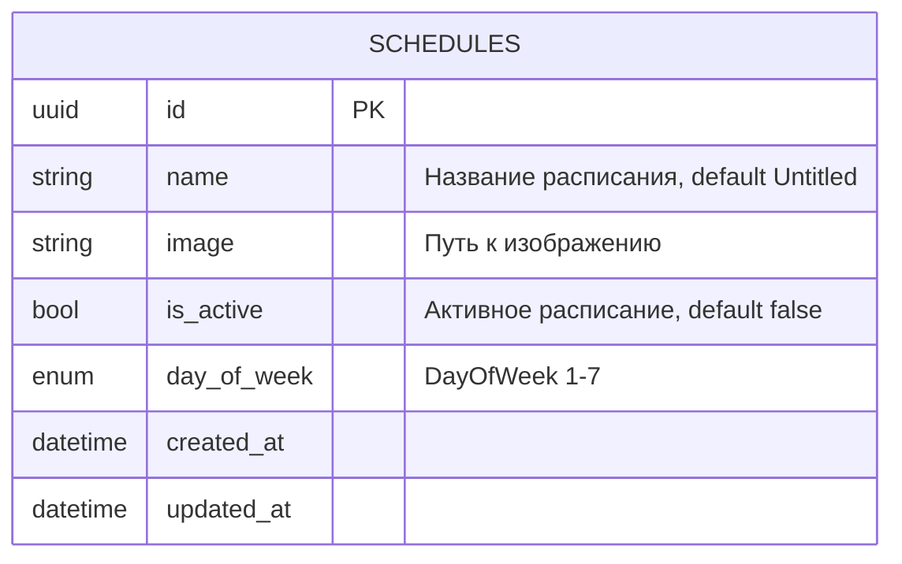
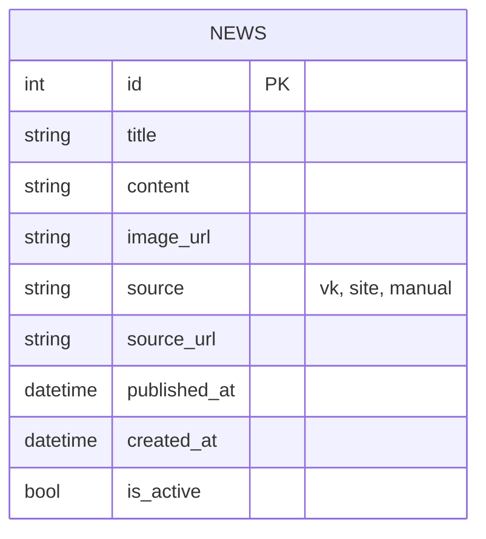
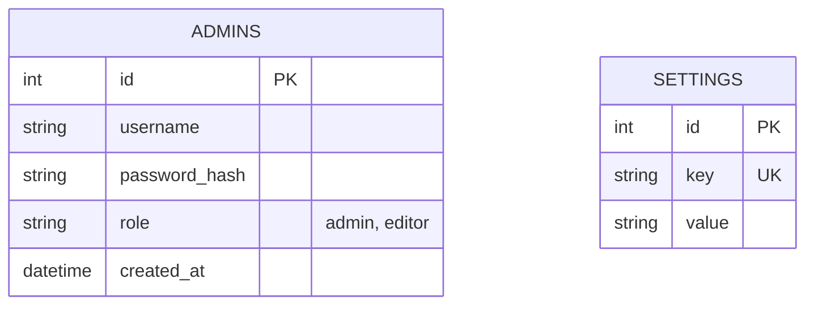
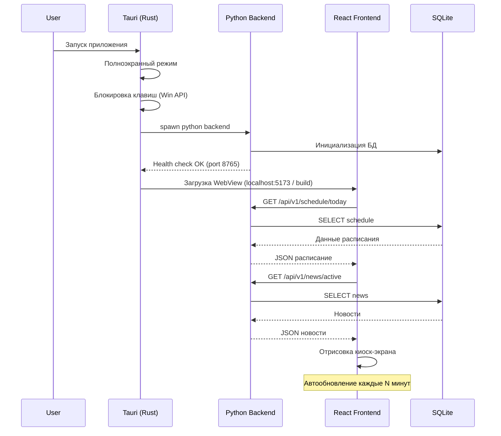
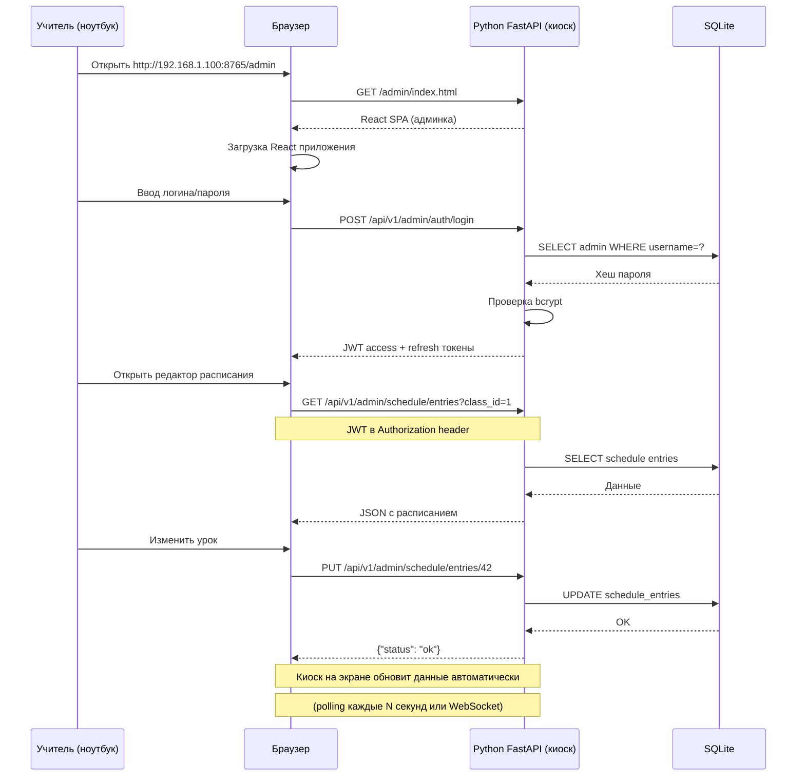

# School Kiosk — Архитектура проекта (Python + Tauri + React)

## 1. Общая архитектура

```
+------------------------------------------------------------------+
|                     Локальная сеть школы                          |
|                                                                   |
|  +----------------------------+    +----------------------------+ |
|  |   ПК с киоском (Windows)   |    |  Ноутбук учителя           | |
|  |                            |    |  (браузер)                 | |
|  |  +----------------------+  |    |                            | |
|  |  |   Tauri Desktop App  |  |    |  http://192.168.1.X:      | |
|  |  |                      |  |    |      8765/admin           | |
|  |  |  +----------------+  |  |    |                            | |
|  |  |  |  WebView       |  |  |    |  - Редактор расписания    | |
|  |  |  |  (Kiosk View)  |  |  |    |  - Редактор новостей      | |
|  |  |  |  - Расписание  |  |  |    |  - Импорт Excel           | |
|  |  |  |  - Новости     |  |  |    |  - Парсинг VK/сайта       | |
|  |  |  |  - Слайдер     |  |  |    |  - Настройки              | |
|  |  |  +----------------+  |  |    |                            | |
|  |  |                      |  |    +----------------------------+ |
|  |  |  +----------------+  |  |                                   |
|  |  |  |  Rust Core     |  |  |    +----------------------------+ |
|  |  |  |  - Kiosk Guard |  |  |    | Смартфон завуча            | |
|  |  |  |  - Win API     |  |  |    | (браузер)                  | |
|  |  |  +-------+--------+  |  |    |                            | |
|  |  +----------+-----------+  |    | http://192.168.1.X:        | |
|  |             |              |    |     8765/admin             | |
|  |  +----------+-----------+  |    +----------------------------+ |
|  |  | Python FastAPI       |  |                                   |
|  |  | (0.0.0.0:8765)       |  |                                   |
|  |  |                      |  |                                   |
|  |  |  - Schedule API      |  |                                   |
|  |  |  - News API          |  |                                   |
|  |  |  - Admin API (JWT)   |  |                                   |
|  |  |  - VK Parser         |  |                                   |
|  |  |  - Site Parser       |  |                                   |
|  |  |  - Excel Import      |  |                                   |
|  |  |                      |  |                                   |
|  |  |  +----------------+  |  |                                   |
|  |  |  |   SQLite DB    |  |  |                                   |
|  |  |  +----------------+  |  |                                   |
|  |  +----------------------+  |                                   |
|  +----------------------------+                                   |
+------------------------------------------------------------------+
```

**Ключевое изменение:** Python FastAPI слушает на `0.0.0.0:8765` (все сетевые интерфейсы), а не только `localhost`. Это позволяет:
- Tauri WebView обращаться к API через localhost (без задержек)
- Устройства в локальной сети обращаться к админке через IP киоска

## 2. Технологический стек

### Desktop оболочка (Rust / Tauri)
| Компонент | Технология | Назначение |
|-----------|-----------|------------|
| Фреймворк | **Tauri v2** | Десктопная оболочка с WebView |
| Язык | **Rust** | Системные вызовы, киоск-режим |
| WebView | **WebView2** (Windows) | Отображение React SPA |
| Киоск-модуль | **Windows API** (user32.dll) | Блокировка Alt+F4, Win, Ctrl+Alt+Del |

### Backend (Python)
| Компонент | Технология | Назначение |
|-----------|-----------|------------|
| Web-фреймворк | **FastAPI** | REST API сервер |
| База данных | **SQLite** (через SQLAlchemy + Alembic) | Хранение данных |
| Парсинг Excel | **openpyxl** | Импорт расписания |
| Парсинг VK | **vk-api** | Получение новостей из VK |
| Парсинг сайта | **httpx + BeautifulSoup4** | Парсинг новостей с сайта |
| Фоновые задачи | **APScheduler** | Периодический парсинг новостей |
| Аутентификация | **python-jose + passlib** | JWT для админки |

### Frontend (React / TypeScript)
| Компонент | Технология | Назначение |
|-----------|-----------|------------|
| Фреймворк | **React 18 + TypeScript** | UI |
| Сборка | **Vite** | Быстрая сборка |
| Роутинг | **React Router v6** | Навигация |
| UI Kit | **Material UI** или **Ant Design** | Готовые компоненты |
| HTTP клиент | **TanStack Query (React Query)** | Работа с API |
| Слайдер | **Swiper.js** | Карусель новостей |
| Таблица | **TanStack Table** | Редактирование расписания |
| Формы | **React Hook Form** | Управление формами |

## 3. Структура проекта

```
school-kiosk/
│
├── src-tauri/                    # Tauri Rust core
│   ├── src/
│   │   ├── main.rs              # Точка входа, запуск Python
│   │   ├── kiosk.rs             # Киоск-режим (Win API)
│   │   ├── admin.rs             # IPC: админ-режим
│   │   └── process.rs           # Управление Python процессом
│   ├── Cargo.toml
│   ├── tauri.conf.json
│   └── icons/                   # Иконки приложения
│
├── backend/                      # Python FastAPI
│   ├── src/                     # Основной пакет приложения
│   │   ├── __init__.py
│   │   ├── main.py              # Точка входа FastAPI (lifespan, create_app)
│   │   │
│   │   ├── core/                # Инфраструктура (настройки, БД)
│   │   │   ├── __init__.py
│   │   │   ├── config.py        # Настройки (pydantic-settings, env_prefix=BACKEND_)
│   │   │   └── database.py      # DBDependency (async engine + session factory)
│   │   │
│   │   ├── apps/                # Функциональные модули (feature-based)
│   │   │   ├── __init__.py
│   │   │   └── schedule/        # Модуль «Расписание»
│   │   │       ├── __init__.py
│   │   │       ├── managers.py  # ScheduleImageManager (бизнес-логика/CRUD)
│   │   │       └── schemas.py   # Pydantic схемы (Create/Update/Get)
│   │   │
│   │   ├── enums/               # Перечисления
│   │   │   ├── __init__.py
│   │   │   └── schedule.py      # DayOfWeek (пн-вс)
│   │   │
│   │   ├── models/              # SQLAlchemy ORM модели (общий слой)
│   │   │   ├── __init__.py      # Экспорт всех моделей + Base
│   │   │   ├── base.py          # Base (DeclarativeBase)
│   │   │   ├── mixins.py        # IDMixin, TimestampMixin, DayOfWeekMixin
│   │   │   └── schedule.py      # ScheduleImage
│   │   │
│   │   └── (планируется)        # routers/, middleware/, tasks/, utils/
│   │
│   ├── alembic/                 # Миграции БД
│   │   ├── env.py               # Настройка Alembic
│   │   ├── script.py.mako       # Шаблон миграций
│   │   └── versions/            # Файлы миграций
│   │       └── 72ce727e6e24_add_model_scheduleimage.py
│   │
│   ├── tests/                   # Тесты
│   │   ├── __init__.py
│   │   ├── conftest.py          # Добавление src/ в sys.path
│   │   ├── unit/                # Юнит-тесты
│   │   │   ├── __init__.py
│   │   │   ├── test_config.py
│   │   │   ├── test_main.py
│   │   │   └── test_schedule_image.py
│   │   └── integration/         # Интеграционные тесты
│   │       └── __init__.py
│   │
│   ├── alembic.ini              # Конфиг Alembic
│   ├── pyproject.toml           # Зависимости + метаданные (Poetry)
│   ├── poetry.lock
│   ├── poetry.toml
│   └── .pre-commit-config.yaml
│
├── frontend/                    # React SPA
│   ├── src/
│   │   ├── main.tsx
│   │   ├── App.tsx
│   │   ├── routes/
│   │   │   ├── KioskView.tsx    # Публичный экран
│   │   │   └── AdminView.tsx    # Админ-панель
│   │   ├── components/
│   │   │   ├── kiosk/
│   │   │   │   ├── ScheduleBoard.tsx
│   │   │   │   ├── NewsSlider.tsx
│   │   │   │   ├── Clock.tsx
│   │   │   │   └── Weather.tsx (опционально)
│   │   │   └── admin/
│   │   │       ├── ScheduleEditor.tsx
│   │   │       ├── NewsEditor.tsx
│   │   │       ├── ExcelImport.tsx
│   │   │       └── Settings.tsx
│   │   ├── api/
│   │   │   ├── client.ts        # Axios/Fetch клиент
│   │   │   ├── schedule.ts
│   │   │   └── news.ts
│   │   ├── hooks/
│   │   ├── types/
│   │   └── styles/
│   ├── index.html
│   ├── vite.config.ts
│   ├── tsconfig.json
│   └── package.json
│
├── scripts/                     # Скрипты для сборки/запуска
│   ├── build.bat                # Полная сборка проекта
│   ├── dev.bat                  # Запуск в режиме разработки
│   └── setup.bat                # Первоначальная настройка окружения
│
├── .env.example                 # Пример переменных окружения
├── .gitignore
├── LICENSE
└── README.md
```

## 4. Детальное описание Python-модулей

### 4.1. `app/main.py` — точка входа

```python
# Назначение: запуск FastAPI приложения через uvicorn
# - Создаёт экземпляр FastAPI (create_app)
# - Инициализирует БД (create_all) в lifespan
# - TODO: подключить роутеры
# - TODO: запустить APScheduler для фоновых задач
# - TODO: настроить middleware (CORS, логирование)

# Запуск: uvicorn src.main:app --host 0.0.0.0 --port 8765
# Или:   app (console script из pyproject.toml -> src.main:start)
```

### 4.2. `src/core/config.py` — конфигурация

```python
# Назначение: все настройки приложения в одном месте
# Источник: переменные окружения с префиксом BACKEND_ + .env файл

class Settings(BaseSettings):
    model_config = {"env_prefix": "BACKEND_"}

    app_name: str = "School Kiosk API"
    app_description: str = "API backend for School Kiosk"
    app_version: str = "0.1.0"

    debug: bool = False
    api_prefix: str = "/api/v1"

    server_host: str = "0.0.0.0"  # доступ из локальной сети
    server_port: int = 8765

    database_url: str = "sqlite+aiosqlite:///school_kiosk.db"
    db_echo: bool = False

    default_admin_login: str = "admin"
    default_admin_password: str = "admin"

settings = Settings()
```

### 4.3. `src/core/database.py` — подключение к БД

```python
# Назначение: настройка SQLAlchemy async engine + session factory
# Реализовано через класс DBDependency (DI для FastAPI)

class DBDependency:
    def __init__(self) -> None:
        self._engine = create_async_engine(
            url=settings.database_url, echo=settings.db_echo
        )
        self._session_factory = async_sessionmaker(
            bind=self._engine, expire_on_commit=False, autocommit=False
        )

    @property
    def db_session(self) -> async_sessionmaker[AsyncSession]:
        return self._session_factory

    @property
    def db_engine(self) -> AsyncEngine:
        return self._engine

db = DBDependency()
```

### 4.4. `src/models/` — ORM модели (общий слой)

#### `models/base.py` — базовый класс
```python
# Базовый DeclarativeBase для всех моделей
class Base(DeclarativeBase):
    pass
```

#### `models/mixins.py` — переиспользуемые миксины
```python
# IDMixin:        id: UUID (primary_key, default=uuid4)
# TimestampMixin: created_at, updated_at (DateTime, default=func.now())
# DayOfWeekMixin: day_of_week: Enum(DayOfWeek)
```

#### `models/schedule.py` — модель расписания (изображение)
```python
class ScheduleImage(IDMixin, TimestampMixin, Base):
    __tablename__ = "schedules"
    name: Mapped[str] = mapped_column(String(255), nullable=False, default="Untitled")
    image: Mapped[str] = mapped_column(String(255), nullable=False)
    is_active: Mapped[bool] = mapped_column(Boolean, default=False, nullable=False)
    day_of_week: Mapped[DayOfWeek] = mapped_column(
        Enum(DayOfWeek), nullable=False, default=DayOfWeek.MONDAY
    )
```

#### `models/news.py` — новости (планируется)
```python
class News(TimestampMixin, Base):
    __tablename__ = "news"
    title: str
    content: str        # HTML или Markdown
    image_url: str | None
    source: str         # "vk", "site", "manual"
    source_url: str | None
    published_at: datetime
    is_active: bool = True
```

#### `models/admin.py` — админы и настройки (планируется)
```python
class Admin(TimestampMixin, Base):
    __tablename__ = "admins"
    username: str       # Уникальный логин
    password_hash: str  # bcrypt hash
    role: str           # "admin" или "editor"

class Settings(Base):
    __tablename__ = "settings"
    key: str = Column(String, primary_key=True)   # "vk_group_id"
    value: str = Column(String)                   # "-123456789"
```

### 4.5. `src/apps/schedule/schemas.py` — Pydantic схемы

```python
# Назначение: валидация входящих данных и форматирование ответов
# Схемы живут внутри модуля приложения (apps/schedule)

class ScheduleImageBase(BaseModel):
    name: str = Field(..., max_length=255)
    image: str = Field(..., max_length=255)
    is_active: bool
    day_of_week: DayOfWeek

class ScheduleImageCreate(BaseModel):
    name: str | None = None
    image: str = Field(...)
    is_active: bool | None = None
    day_of_week: DayOfWeek | None = None

class ScheduleImageUpdate(BaseModel):
    name: str | None = None
    image: str | None = None
    is_active: bool | None = None
    day_of_week: DayOfWeek | None = None

class ScheduleImageGet(ScheduleImageBase):
    id: uuid.UUID
    create_at: datetime
    update_at: datetime
    model_config = ConfigDict(from_attributes=True)
```

### 4.6. `src/apps/*/routers.py` — API endpoints (планируется)

> **Статус:** роутеры ещё не реализованы. В `src/main.py` есть TODO «подключить роутеры».
> Роутеры будут жить внутри модулей приложений (`src/apps/schedule/routers.py`), а не в отдельной глобальной папке.

```python
# GET /health -> {"status": "ok", "version": "1.0.0"}
# Используется Tauri для проверки, что Python backend запущен
```

#### Публичные endpoint'ы киоска (планируется)
```python
# GET  /api/v1/schedule/today?class_id=X  -> расписание на сегодня
# GET  /api/v1/schedule/now?class_id=X    -> какой урок сейчас идёт
# GET  /api/v1/schedule/week?class_id=X   -> расписание на неделю
# GET  /api/v1/schedule/classes           -> список классов
# GET  /api/v1/news/active                -> активные новости
# GET  /api/v1/kiosk/settings             -> настройки отображения
```

#### Админ CRUD расписания (планируется)
```python
# Все endpoint'ы защищены JWT (Depends(get_current_admin))
# GET    /api/v1/admin/schedule/classes        -> список классов
# POST   /api/v1/admin/schedule/classes        -> создать класс
# PUT    /api/v1/admin/schedule/classes/:id    -> обновить класс
# DELETE /api/v1/admin/schedule/classes/:id    -> удалить класс
# ...аналогично для subjects, teachers, entries
# POST   /api/v1/admin/schedule/import-excel   -> импорт Excel
```

#### Админ CRUD новостей (планируется)
```python
# GET    /api/v1/admin/news                    -> все новости (с пагинацией)
# POST   /api/v1/admin/news                    -> создать новость
# PUT    /api/v1/admin/news/:id                -> обновить новость
# DELETE /api/v1/admin/news/:id                -> удалить новость
# POST   /api/v1/admin/news/parse-vk           -> запустить парсинг VK
# POST   /api/v1/admin/news/parse-site         -> запустить парсинг сайта
```

#### Аутентификация и настройки (планируется)
```python
# POST /api/v1/admin/auth/login       -> вход, получение JWT
# POST /api/v1/admin/auth/refresh     -> обновление токена
# GET  /api/v1/admin/settings         -> получить настройки
# PUT  /api/v1/admin/settings         -> обновить настройки
```

### 4.7. `src/apps/*/managers.py` — бизнес-логика (менеджеры)

> **Статус:** реализован `ScheduleImageManager`. Менеджер — аналог Service/Repository/DAO.
> Живёт внутри модуля приложения (`src/apps/schedule/managers.py`).

#### `apps/schedule/managers.py` — ScheduleImageManager (реализован)
```python
class ScheduleImageManager:
    def __init__(self, db: DBDependency = Depends(DBDependency)) -> None:
        self.db = db
        self.model = ScheduleImage

    async def create(self, schedule: ScheduleImageCreate) -> ScheduleImageGet:
        async with self.db.db_session as session:
            query = insert(self.model).values(**schedule.model_dump()).returning(self.model)
            try:
                result = await session.execute(query)
            except IntegrityError as e:
                raise HTTPException(status_code=400, detail=str(e))
            await session.commit()
            schedule_data = result.scalar_one()
            return ScheduleImageGet.model_validate(schedule_data)
```

#### Правила проектирования менеджера
- Один менеджер — одна сущность (`ScheduleImageManager` работает только с `ScheduleImage`).
- Принимает Pydantic-схемы, возвращает Pydantic-схемы (граница между API и БД).
- Управляет сессией и транзакциями (открывает сессию, коммитит).
- Обрабатывает ошибки БД (`IntegrityError` -> `HTTPException`).
- Получает зависимости через DI (`Depends(DBDependency)`).
- Именование: `<Entity>Manager`.

#### Планируемые менеджеры
```python
# ScheduleManager (расписание на неделю, текущий урок, импорт Excel)
# - get_today_schedule(class_id) -> расписание на сегодня
# - get_week_schedule(class_id) -> расписание на неделю
# - get_current_lesson(class_id) -> какой урок сейчас
# - create_entry(data) -> создать запись
# - update_entry(id, data) -> обновить запись
# - delete_entry(id) -> удалить запись
# - import_from_excel(file) -> импорт из Excel

# NewsManager (новости)
# - get_active_news() -> активные новости
# - create_news(data) -> создать
# - update_news(id, data) -> обновить
# - delete_news(id) -> удалить

# AuthManager (JWT, пароли, токены)
# - authenticate(username, password) -> Admin | None
# - create_access_token(admin) -> JWT строка
# - create_refresh_token(admin) -> JWT строка
# - verify_token(token) -> Admin | None
# - hash_password(password) -> hash
# - verify_password(password, hash) -> bool

# ExcelImporter (парсинг Excel -> schedule)
# - parse_excel(file_path) -> list[ScheduleEntryCreate]
#   Ожидаемый формат Excel:
#   Колонки: Класс | Предмет | Учитель | День | Урок | Кабинет | Тип_недели
# - validate_data(entries) -> list[ValidationError]
# - import_to_db(entries) -> int (сколько импортировано)

# VkParser (парсинг VK API -> news)
# - fetch_news(count=10) -> list[NewsCreate]
#   Использует VK API (wall.get) для получения постов из группы
# - parse_post(post) -> NewsCreate
#   Извлекает: текст, картинки, дату

# SiteParser (парсинг HTML сайта -> news)
# - fetch_news(url) -> list[NewsCreate]
#   Парсит HTML школьного сайта
# - parse_html(html) -> list[NewsCreate]
#   Ищет: заголовки, текст, изображения
```

### 4.8. `src/core/middleware/` — middleware (планируется)

```python
# auth.py:  JWTBearer middleware для защиты админ-роутов
# cors.py:  CORS middleware (разрешаем всё для локальной сети)
# logging.py: Логирование всех HTTP запросов (method, path, status, duration)
```

### 4.9. `src/core/tasks/` — фоновые задачи (планируется)

```python
# scheduler.py: Настройка APScheduler
#   - Запускается при старте приложения
#   - Регистрирует задачи

# news_sync.py: Периодический парсинг новостей
#   - Раз в N минут проверяет VK и сайт
#   - Добавляет новые новости в БД
#   - Не дублирует существующие (по source_url)

# cache_cleanup.py: Очистка устаревших данных
#   - Удаляет неактивные новости старше 30 дней
#   - Оптимизирует SQLite (VACUUM)
```

### 4.10. `src/core/utils/` — утилиты (планируется)

```python
# date_utils.py:
#   - get_current_week_type() -> 1|2 (числитель/знаменатель)
#   - get_day_of_week() -> 1-7
#   - get_lesson_time(lesson_number) -> (start, end)
#   - is_lesson_now(lesson_number) -> bool

# hash_utils.py:
#   - hash_password(password) -> str (bcrypt)
#   - verify_password(password, hash) -> bool

# file_utils.py:
#   - save_uploaded_file(file) -> str (путь к сохранённому файлу)
#   - cleanup_temp_files()
```

### 4.11. `tests/` — тесты

> **Статус:** реализованы юнит-тесты модели `ScheduleImage`. Интеграционные тесты — планируются.

```python
# conftest.py:
#   - Добавляет src/ в sys.path (для импорта src.*)

# unit/test_config.py:        настройки Settings
# unit/test_main.py:          корневой endpoint "/"
# unit/test_schedule_image.py: модель ScheduleImage (defaults, columns, UUID, repr)

# integration/ (планируется):
#   - test_db: отдельная SQLite БД для тестов
#   - test_client: AsyncClient для FastAPI
#   - seed_test_data: наполнение тестовыми данными
#   - test_health.py:       GET /health -> 200
#   - test_schedule.py:     CRUD расписания
#   - test_news.py:         CRUD новостей
#   - test_auth.py:         логин, токены, защита роутов
#   - test_excel_import.py: импорт Excel
#   - test_parsers.py:      парсинг VK и сайта (с моками)
```

### 4.12. `scripts/` — вспомогательные скрипты (планируется)

```python
# seed_data.py:
#   - Создаёт тестовые классы (10А, 11Б, ...)
#   - Создаёт тестовые предметы (Математика, Физика, ...)
#   - Создаёт тестовое расписание на неделю
#   - Создаёт тестовые новости
#   - Создаёт администратора (admin/admin123)

# create_admin.py:
#   - Создаёт нового администратора
#   - Запрашивает логин/пароль/роль

# reset_db.py:
#   - Удаляет БД
#   - Создаёт новую
#   - Применяет миграции
```

## 5. Модели данных (SQLite)

### schedule (расписание) — реализовано: ScheduleImage


> **Примечание:** текущая модель `ScheduleImage` хранит расписание как **изображение** (файл), а не как структурированные записи. Модели `Class`, `Subject`, `Teacher`, `ScheduleEntry` из первоначального плана пока не реализованы — они планируются для структурированного расписания.

### news (новости) — планируется


### admin (администраторы) — планируется


## 6. API Endpoints

> **Статус:** реализован только корневой endpoint `GET /`. Остальные endpoint'ы — планируются.

### Реализовано
| Method | Path | Описание |
|--------|------|----------|
| GET | `/` | Корневой endpoint (health-проверка сервиса) |

### Публичные (киоск) - планируются, доступны без авторизации
| Method | Path | Описание |
|--------|------|----------|
| GET | `/api/v1/schedule/today?class_id=X` | Расписание на сегодня |
| GET | `/api/v1/schedule/week?class_id=X` | Расписание на неделю |
| GET | `/api/v1/schedule/classes` | Список классов |
| GET | `/api/v1/news/active` | Активные новости |
| GET | `/api/v1/kiosk/settings` | Настройки киоска |

### Админ (требуют JWT) - планируются, доступны и с киоска, и из локальной сети
| Method | Path | Описание |
|--------|------|----------|
| POST | `/api/v1/admin/auth/login` | Вход (логин/пароль -> JWT) |
| POST | `/api/v1/admin/auth/refresh` | Обновление токена |
| GET | `/api/v1/admin/schedule/classes` | CRUD классы |
| POST | `/api/v1/admin/schedule/classes` | Создать класс |
| PUT | `/api/v1/admin/schedule/classes/:id` | Обновить класс |
| DELETE | `/api/v1/admin/schedule/classes/:id` | Удалить класс |
| GET | `/api/v1/admin/schedule/subjects` | CRUD предметы |
| POST | `/api/v1/admin/schedule/subjects` | Создать предмет |
| PUT | `/api/v1/admin/schedule/subjects/:id` | Обновить предмет |
| DELETE | `/api/v1/admin/schedule/subjects/:id` | Удалить предмет |
| GET | `/api/v1/admin/schedule/teachers` | CRUD учителя |
| POST | `/api/v1/admin/schedule/teachers` | Создать учителя |
| PUT | `/api/v1/admin/schedule/teachers/:id` | Обновить учителя |
| DELETE | `/api/v1/admin/schedule/teachers/:id` | Удалить учителя |
| GET | `/api/v1/admin/schedule/entries?class_id=X` | Получить расписание для класса |
| POST | `/api/v1/admin/schedule/entries` | Создать запись |
| PUT | `/api/v1/admin/schedule/entries/:id` | Обновить запись |
| DELETE | `/api/v1/admin/schedule/entries/:id` | Удалить запись |
| POST | `/api/v1/admin/schedule/import-excel` | Импорт Excel |
| GET | `/api/v1/admin/news` | Список новостей |
| POST | `/api/v1/admin/news` | Создать новость |
| PUT | `/api/v1/admin/news/:id` | Обновить новость |
| DELETE | `/api/v1/admin/news/:id` | Удалить новость |
| POST | `/api/v1/admin/news/parse-vk` | Парсинг VK |
| POST | `/api/v1/admin/news/parse-site` | Парсинг сайта |
| GET | `/api/v1/admin/settings` | Получить настройки |
| PUT | `/api/v1/admin/settings` | Обновить настройки |

## 7. Киоск-режим (Rust)

Tauri Rust core будет реализовывать тот же функционал, что сейчас в C#:

```rust
// src-tauri/src/kiosk.rs
struct KioskGuard {
    // Блокировка клавиш через Windows API (SetWindowsHookEx)
    // - Alt+F4
    // - Alt+Tab
    // - Win (левая/правая)
    // - Ctrl+Alt+Del
    // - Escape
    // - Context Menu

    // Режим администратора:
    // - Ctrl+Shift+A -> toggle admin mode
    // - Ctrl+Alt+X -> exit kiosk (только в admin mode)

    // Управление окном:
    // - Fullscreen (без рамки)
    // - Topmost (поверх всех окон)
    // - Скрытие курсора при бездействии
}
```

## 8. План реализации (поэтапный)

### Этап 1: Backend (Python FastAPI)
- [x] 1. Инициализация Python проекта, структура папок (Poetry, src/, core/, apps/, models/, enums/)
- [x] 2. Модели БД (SQLAlchemy) + миграции (Alembic) — реализована модель `ScheduleImage` + миграция `72ce727e6e24`
- [x] 3. Менеджер `ScheduleImageManager` (CRUD create) + Pydantic схемы
- [x] 4. Юнит-тесты модели `ScheduleImage`
- [ ] 5. Роутеры (API endpoints) — TODO в `src/main.py`
- [ ] 6. API для расписания (CRUD + Excel import)
- [ ] 7. API для новостей (CRUD + VK parser + site parser)
- [ ] 8. Админ API (JWT auth, настройки)
- [ ] 9. Интеграционные тесты API (через Swagger/Postman)

### Этап 2: Frontend (React)
1. Инициализация React + Vite + TypeScript
2. KioskView: расписание (таблица на день/неделю)
3. KioskView: слайдер новостей
4. KioskView: часы, дата, оформление
5. AdminView: авторизация
6. AdminView: редактор расписания
7. AdminView: редактор новостей + импорт
8. AdminView: настройки

### Этап 3: Tauri оболочка
1. Инициализация Tauri проекта
2. Перенос KioskGuard из C# в Rust
3. Запуск Python backend как child process
4. Интеграция React frontend в Tauri
5. Сборка и тестирование

### Этап 4: Сборка и деплой
1. Скрипты сборки (build.bat)
2. Инсталлятор (NSIS или WiX)
3. Документация

## 9. Ключевые решения

| Решение | Выбор | Обоснование |
|---------|-------|-------------|
| База данных | SQLite | Не требуется сервер, файл БД рядом с приложением |
| Парсинг VK | vk-api (официальный API) | Стабильнее парсинга HTML |
| Парсинг сайта | BeautifulSoup4 | Гибкий парсинг HTML |
| Аутентификация | JWT (access + refresh) | Без сессий, подходит для SPA |
| Запуск Python | Tauri spawn + health check | Автоматический старт/стоп с приложением |
| Сборка React | Vite | Быстрая, современная |
| UI Kit | Material UI | Популярный, много компонентов |
| **Сеть API** | **0.0.0.0:8765** | **Доступ из локальной сети для админки** |
| **CORS** | **Разрешён с любых origin** | **Админка открывается с разных устройств** |
| **Фронтенд админки** | **Отдельный SPA build** | **Можно хостить отдельно или через FastAPI** |
| **Структура backend** | **Feature-based (src/apps/)** | **Модули приложений (schedule, news, admin) с собственной логикой** |
| **Бизнес-логика** | **Managers (вместо services)** | **Менеджер = Service/Repository/DAO, живёт внутри модуля приложения** |
| **ORM-модели** | **Общий слой src/models/** | **Модели вынесены из модулей приложений в общий слой** |
| **Конфигурация** | **pydantic-settings, env_prefix=BACKEND_** | **Настройки из переменных окружения + .env** |
| **DI для БД** | **DBDependency (класс-зависимость)** | **Инкапсулирует engine + session factory, легко тестировать** |

## 10. Диаграмма последовательности (запуск приложения)



## 11. Диаграмма последовательности (удалённая админка)



## 12. Варианты доставки админ-панели

Есть два варианта, как пользователь получает админку в браузере:

### Вариант A: FastAPI раздаёт статику (рекомендуется)
```
http://192.168.1.100:8765/admin  ->  FastAPI static files -> index.html
```
- **Плюсы:** Проще, один порт, не нужно настраивать отдельный сервер
- **Минусы:** Нужно пересобрать React при изменении админки

### Вариант B: Отдельный dev-сервер для админки
```
http://192.168.1.100:5173/admin  ->  Vite dev server
```
- **Плюсы:** Hot reload при разработке
- **Минусы:** Два порта, сложнее деплой

**Рекомендация:** Вариант A для продакшна, Вариант B для разработки.

## 13. Безопасность при удалённом доступе

1. **JWT токены** с ограниченным сроком (access: 1h, refresh: 24h)
2. **Пароли** хранятся в bcrypt
3. **CORS** настроен для доступа с любых устройств в локальной сети
4. **HTTPS** не требуется (всё в локальной сети)
5. **IP-фильтрация** (опционально) — можно ограничить доступ по IP-адресам
6. **Логирование** всех действий админа (кто, когда, что изменил)
7. **Автоматический logout** при бездействии (15 минут)
8. **API ключ** для внутренней коммуникации Tauri -> Python (защита от внешних запросов к публичным API)

## 14. Сборка и единый установщик

### Общая схема сборки

```
Исходники                          Сборка                    Установщик
──────────────────────────────────────────────────────────────────────────

frontend/                         frontend/dist/
  src/                              index.html       ─┐
  package.json    ── Vite build ──> assets/*.js      ─┤
                                    assets/*.css     ─┤
                                                     ─┤
backend/                          backend/dist/       ─┤
  app/                              python-backend/   ─┤
  requirements.txt ─ PyInstaller ─> python-backend.exe─┤
                                                     ─┤
src-tauri/                        src-tauri/target/   ─┤
  src/                              release/          ─┤
  Cargo.toml     ── cargo build ─> kiosk.exe         ─┤
  tauri.conf.json                   bundle/           ─┤
                                    school-kiosk.msi  ─┘
                                    school-kiosk.exe (NSIS)
```

### Этап 1: Сборка React (Vite)

```bash
cd frontend
npm install
npm run build
# Результат: frontend/dist/  (статический HTML+JS+CSS)
```

Tauri автоматически встраивает папку `frontend/dist/` в бинарник на этапе компиляции (через `tauri.conf.json` → `build.distDir`).

### Этап 2: Упаковка Python (PyInstaller)

```bash
cd backend
pip install -r requirements.txt
pip install pyinstaller
pyinstaller --onefile ^
    --name python-backend ^
    --hidden-import uvicorn ^
    --hidden-import sqlalchemy ^
    --add-data "app:app" ^
    app/main.py
# Результат: backend/dist/python-backend.exe  (~30-50MB)
```

**Параметр `--onefile`** создаёт один .exe, который при запуске распаковывается во временную папку. Это самодостаточный Python со всеми зависимостями.

### Этап 3: Сборка Tauri + создание установщика

```bash
cd src-tauri
cargo tauri build
# Результат:
#   src-tauri/target/release/kiosk.exe  (~5MB, сам Tauri)
#   src-tauri/target/release/bundle/msi/school-kiosk-1.0.0.msi
#   src-tauri/target/release/bundle/nsis/school-kiosk-1.0.0.exe
```

**Tauri bundler** делает следующее:
1. Компилирует Rust-код в `kiosk.exe`
2. Встраивает React-статику (`frontend/dist/`) внутрь `kiosk.exe`
3. Копирует `python-backend.exe` рядом с `kiosk.exe`
4. Создаёт установщик (MSI или NSIS), который включает оба файла

### Что входит в установщик

```
C:\Program Files\School Kiosk\
├── kiosk.exe              # Tauri + React (встроена статика)
├── python-backend.exe     # Python FastAPI (PyInstaller bundle)
├── school_kiosk.db        # SQLite (создаётся при первом запуске)
└── config.json            # Настройки (порт, автозапуск и т.д.)
```

**Итоговый размер установщика:** ~40-60 MB
- Python + зависимости: ~30-50 MB (PyInstaller)
- Tauri + React: ~5-8 MB
- Установщик (сжатие): ~20-30 MB

### Что НЕ нужно устанавливать на ПК пользователя

| Компонент | Где находится |
|-----------|--------------|
| Python 3.11 | Встроен в `python-backend.exe` |
| FastAPI + Uvicorn | Встроен в `python-backend.exe` |
| SQLAlchemy + SQLite | Встроен в `python-backend.exe` |
| Node.js / npm | Не нужен |
| Rust / Cargo | Не нужен |
| WebView2 Runtime | Уже есть на Windows 10/11 |

### Процесс запуска приложения

```
Пользователь запускает kiosk.exe
         │
         ▼
Tauri стартует
         │
         ├── 1. Запускает python-backend.exe как child process
         │         │
         │         ▼
         │    Python инициализирует БД (если нет — создаёт)
         │    Python запускает FastAPI на 0.0.0.0:8765
         │
         ├── 2. Ждёт health check от Python (GET /health)
         │
         ├── 3. Открывает WebView с React SPA
         │
         └── 4. Активирует киоск-режим (блокировка клавиш)
```

### Скрипт полной сборки (build.bat)

```batch
@echo off
echo === School Kiosk Build Script ===

echo [1/4] Installing frontend dependencies...
cd frontend
call npm install

echo [2/4] Building React frontend...
call npm run build

echo [3/4] Building Python backend...
cd ../backend
call pyinstaller --onefile --name python-backend app/main.py

echo [4/4] Building Tauri app + installer...
cd ../src-tauri
call cargo tauri build

echo === Build complete! ===
echo Installer: src-tauri/target/release/bundle/nsis/school-kiosk-*.exe
```

### Автоматизация через GitHub Actions (CI/CD)

```yaml
# .github/workflows/build.yml
name: Build and Release
on:
  push:
    tags:
      - 'v*'

jobs:
  build:
    runs-on: windows-latest
    steps:
      - uses: actions/checkout@v4

      - name: Setup Python
        uses: actions/setup-python@v5
        with:
          python-version: '3.11'

      - name: Setup Node.js
        uses: actions/setup-node@v4
        with:
          node-version: '20'

      - name: Setup Rust
        uses: actions-rust-lang/setup-rust-toolchain@v1

      - name: Build React
        run: |
          cd frontend
          npm install
          npm run build

      - name: Build Python
        run: |
          cd backend
          pip install -r requirements.txt
          pip install pyinstaller
          pyinstaller --onefile --name python-backend app/main.py

      - name: Build Tauri
        run: |
          cd src-tauri
          cargo tauri build

      - name: Upload installer
        uses: actions/upload-artifact@v4
        with:
          name: school-kiosk-installer
          path: src-tauri/target/release/bundle/nsis/*.exe
```

## 15. Требования к окружению

### Для разработки
- **Python 3.11+** + pip
- **Node.js 18+** + npm/yarn
- **Rust** (rustup + cargo)
- **Tauri CLI** (`cargo install tauri-cli`)
- **WebView2 Runtime** (предустановлен на Win10/11)

### Для сборки (продакшн)
- Python bundled с приложением (PyInstaller)
- React собран в статику (Vite build)
- Tauri bundler создаёт единый .msi/.exe установщик
- Всё работает из коробки на чистой Windows 10/11
